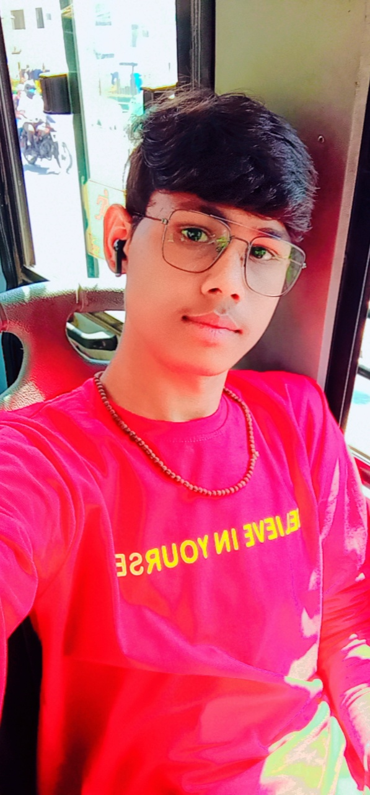

<html> 
<head> <title> MY PERSONAL BIO DATA</title>  
  <link href="https://cdnjs.cloudflare.com/ajax/libs/font-awesome/4.7.0/css/font-awesome.min.css"  rel="stylesheet" type="text/css" />
           
  <link rel="stylesheet" href="https://maxcdn.bootstrapcdn.com/bootstrap/3.3.7/css/bootstrap.min.css" />
    <link href="animate.css" rel="stylesheet" type="text/css" />

     
</head> 
<body>  
  
      

      
       <ul> 
           <li>  <B style="font-size: 30PX; font-style: italic;  color: black; margin-left: -40PX;"> C V </B>  </li>
         <li ><b style="font-size: 20px; margin-left: -30px; font-style: italic; color: bisque ;">Sandip Parmar A.</b> </li>  
         <li><a href="#"> <b> <i class="fa fa-user" aria-hidden="true" style="margin-right:15px"></i>Intro</b></a> </li>   
         <li><a href="#"> <b> <i class="fa fa-object-group" aria-hidden="true" style="margin-right:15px"></i>object</b></a> </li>   
         <li><a href="#"> <b><i class="fa fa-graduation-cap" aria-hidden="true"  style="margin-right:15px"></i>Education</b></a> </li>   
         <li><a href="#"> <b><i class="fa fa-cogs" aria-hidden="true"  style="margin-right:15px"></i>Skills</b></a> </li>   
         <li><a href="#"> <b> </i> Intrest </b></a> </li>   
         <li><a href="#"> <b> <i class="fa fa-trophy" aria-hidden="true"  style="margin-right:15px"></i>Achivments </b></a> </li> 
         <li><a href="#"> <b>Hobbies </b></a> </li>   
 
       </ul>

      

      

         </IMG> 
         
 

    

        <video src="BG VIDEO.mp4" autoplay  loop muted class="fullscreen_bg_video"> </video> 
         
 
          
         

          

               

               
<h2>sandip parmar a.</h2>

               

                   

                        
<i class="fa fa-2x fa-phone"></i> +91- 6355806132

                   

                   

                        
<i class="fa fa-2x fa-envelope"></i> <a href="mailto:hetshri.sakariya@gmail.com" style="color:#ffffff;">sandipparmar2722@gmail.com</a>

                   

               

               

                  
                    

                      
<i class="fa fa-2x fa-map-marker"></i> 06, mahavir nagar socity ,near sugyan school,opp divy pabha aprtment,virat nagar odhav ,38

                 

                   

               

               

               

               
<a href="#"><i class="fa fa-2x fa-facebook-square"></i></a> &nbsp;<a href="#"><i class="fa fa-2x fa-twitter-square"></i></a> &nbsp;<a href="#"><i class="fa fa-2x fa-linkedin-square"></i></a> &nbsp;<a href="#"><i class="fa fa-2x fa-instagram"></i></a>

          

     

   

 

</body>
</html>
